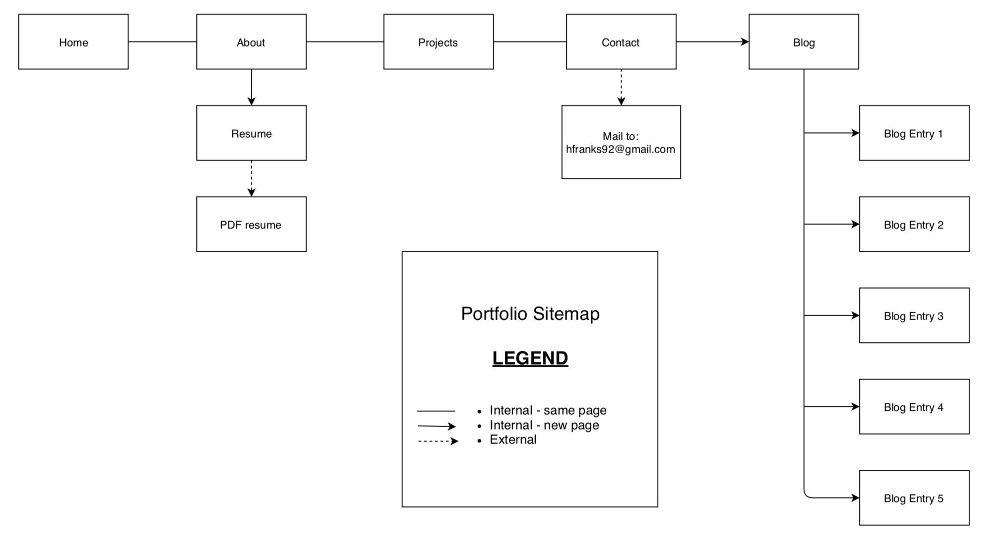
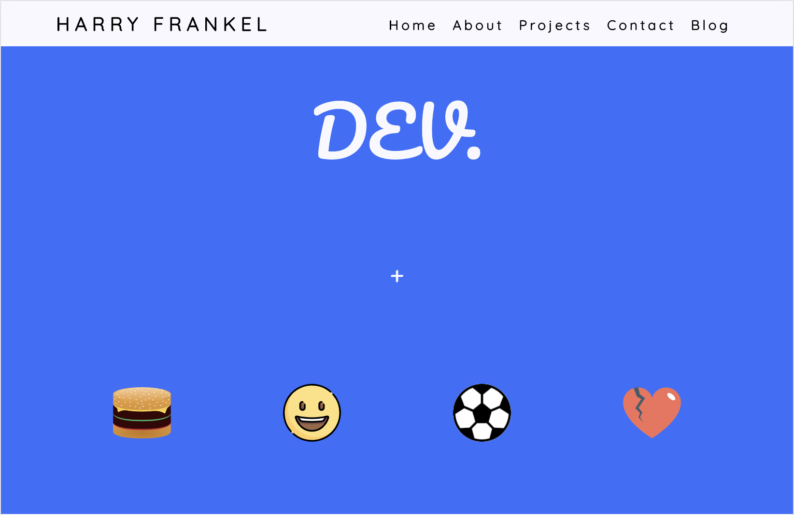
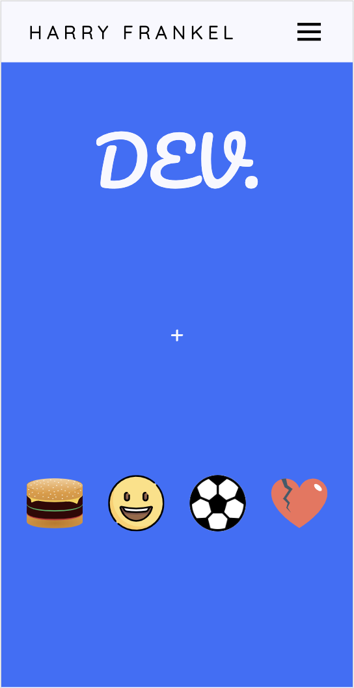
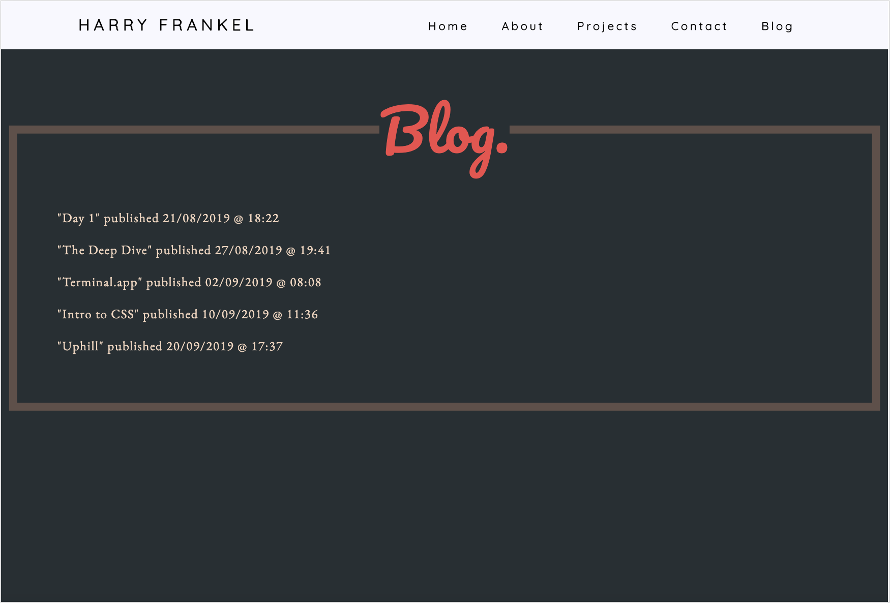
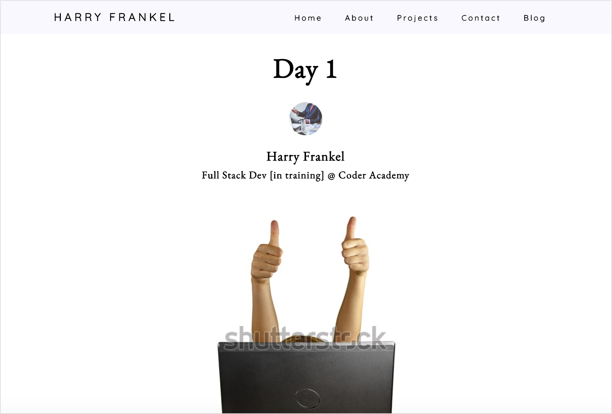

# Software Development Plan - Portfolio Website

https://harryfrankel.netlify.com/

[Github](https://github.com/hfrankel/portfolio_website)

### <u>Purpose / Audience</u>

This portfolio webiste was created to showcase my skills as a developer and personal interests with the intent of connecting and collaborating with other like-minded developers and potential employers. 

### <u>Features</u>

##### <u>Clean Crisp Design</u>

Minimalist design of small chunks of text with big, bold headings in an asymmetrical pattern with contemporary, trendy colour combinations add to a capitivating UI.

##### <u>Responsive Build</u>

Designed for the mobile up with a responsive build. Hamburger menu switches out for top navbar in desktop version. The site is not designed for specific device breakpoints as there is such a huge variety but rather to keep the design flow as it changes size.

##### <u>High Level Accessibility</u>

With a perfect desktop accessbility score of 100 and 93 for mobile, (using Chrome's audit tools) the site has a high level of accessiblity.

##### <u>Connect</u>

The site has multiple external links to various professional accounts including GitHub, LinkedIn and CodePen with also the option of direct contact using email.

### <u>Tech Stack</u>

<ul>
  <li> HTML5
  <li> CSS3
  <li> JavaScript
  <li> Netlify (hosting)
</ul>

### <u>Sitemap</u>

### <u>The Site</u>

Some of the site pages.

